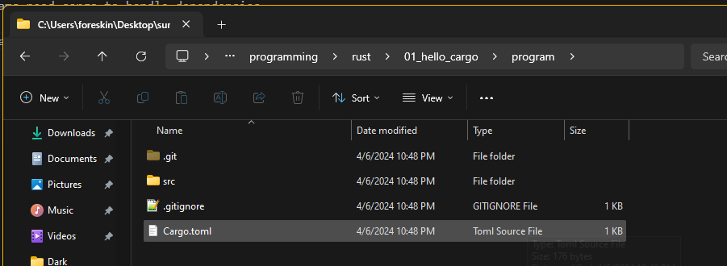
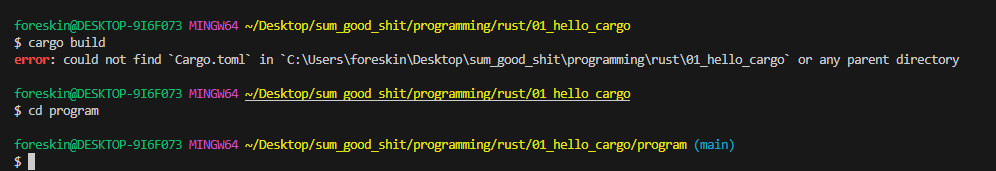
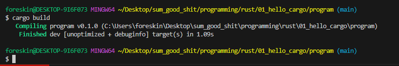

#
# [Back](./../notes.md)

## Cargo: Rust's build system
* Also, package manager
* Cargo handles tasks such as:
    * Building code.
    * Downloading libraries your code depends on
    * Building those libraries.
* Handles dependencies.
    * simple programs only need cargo to build code.
    * But, complicated programs need cargo to handle dependencies.

This, for instance, would create a new directory:
```
cargo new hello_cargo
```

In the case here in this directory, we used:
```
cargo new program
```

This created an entire repo like so:


* From the documentation, if you are already in a git repo, then it will not create a git repo when using this command, but the other stuff.

## Cargo.toml
* TOML: Tom's Obvious, Minimal Language
* [package] - we define:
    * The name
    * The version of our program
    * The edition of rust we will use

* [dependencies]
    * Used for `crates` which are packages of code.

## Using Cargo
* Better to use this with rust since it is operating system independent!
    * Easy build commands!
* Ensure that you are in your cargo directory when running cargo build commands:



* Running:
```
cargo build
```
* Should look something like this:



* Cargo.lock is created, which keeps track of exact dependencies.
    * Automatically generated.
    * Good thing to check if things aren't working.
        * Wrong version of crate (library) perhaps?

* Running:
```
cargo run
```
* Compiles and then executes code.

* Another option (to not run):
```
cargo check
```
* Checks for errors in code.
* Does not generate executable.
* Great for checking your code while editing to speed up development time.

#
# [Back](./../notes.md)