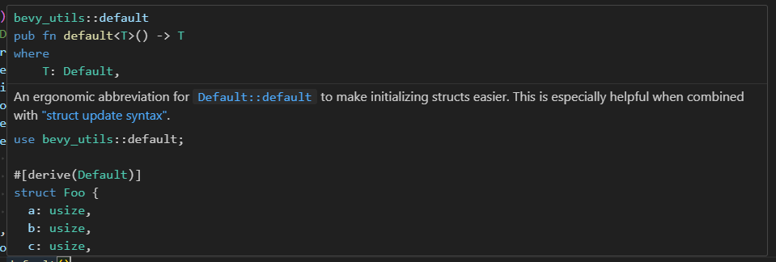

#
# [Back](./../../README.md)

## Mutability
* Vars by default are immutable.
* using the `mut` keyword, we can make changes.

## Constants
* CANNOT be mutable.
* Can never be changed.
* Same rules as C/C++

```rs
const THREE_HOURS_IN_SECONDS: u32 = 60 * 60 * 3;
```
* This will be evaluated at compile time, so no need to worry about runtime performance.

## Shadowing
* You can declare a new variable with the same name as a previous variable.
    * The 2nd variable is what the compiler will see when you use it.
* A way to get around immutability, but know that the value will be set to a different value until that variable is shadowed again.

```rs
let spaces = "   ";
let spaces = spaces.len();
```
* A nice and reasonable example.
* Nice because you may not want to use spaces again.

```rs
let mut spaces = "   ";
spaces = spaces.len();
```
* Do note however that this is invalid code and will lead to compiler errors.

## Data Types
* Here, Rust needs more info:
```rs
let guess: u32 = "42".parse().expect("Not a number!");
```
* So, we need to add the `: u32` to tell Rust that we are expecting a number

```rs
let guess = 42;
```
* While not required declare the type, it may be useful if we want the number to be unsigned.

### Integer types in rust
| Length  | Signed | Unsigned |
| :----:  | :----: | :------: |
| 8-bit   | i8     | u8       |
| 16-bit  | i16    | u16      |
| 32-bit  | i32    | u32      |
| 64-bit  | i64    | u64      |
| 128-bit | i128   | u128     |
| arch    | isize  | usize    |
* arch depends on the architecture of your system

### Typed Number literals
```rs
57u8 // valid number literal

let test_val: u8 = 57u8;
```

### Integer Overflow
* Rust sees integer overflow as an error.
    * In debug mode that is, Rust will cause a `panic`
        * Yes, it is actually called a panic when this happens in debug mode.
    * In release mode, wrapping will occur like it does in C.
* You are not supposed to rely on this in Rust's eyes.

### Floats
* Default type is `f64` - which means a 64 bit float

### Tuple Access in Rust:
```rs
fn main() {
    let x: (i32, f64, u8) = (500, 6.4, 1);

    let five_hundred = x.0;
    let six_point_four = x.1;
    let one = x.2;
}
```
* Accessing tuple elements directly

Is this struct considered a tuple in Rust???
* Or, at least, is this accessed like one?
```rs
#[derive(Component)]
struct Name(String);

/** 
 * update_people -- make sure it is run before greet_people and after add_people
 */
fn update_people(mut query: Query<&mut Name, With<Person>>) {
    for mut name in &mut query {
        if name.0 == "Cha Hoad" {
            name.0 = "Cha Boner".to_string();
            break; // We don’t need to change any other names
        }
    }
}
```

* This is true, Structs can be declared as tuples:
```rs
struct Point {
    x: f32, 
    y: f32,
    z: f32,
}

struct PointTuple(f32, f32, f32); // Tuples have to be declared without variable names

fn main() {
    // Here is a basic struct definition
    let point = Point {
        x: 32f32,
        y: 64f32,
        z: 96f32,
    };

    // here is the definition of a Struct Tuple we see a lot in Bevy
    let alt_point = PointTuple(1.0f32, 2.0f32, 3.0f32);

    // update the remaining fields not explicitly set
    let point_shorthand = Point {
        x: 64f32,
        ..point
    };
}
```
* As you can see here, tuples can be amazing for simple structs because of hwo simple their definitions are compared to normal structs.
* Alternatively, you can use the shorthand seen in point_shorthand.
    * Which is the same as the `..default()` you see in bevy a lot.
    * Guessing that means some default struct is used within rust? or Bevy?


* Yes, `..default()` populates a Bevy struct object with default values for all the values not populated.
* This is handy for shorthand definitions if you only want to set a few params:

```rs
fn main() {
    App::new().add_plugins(DefaultPlugins.set(WindowPlugin {
        // TODO: Make most of these windows attributes non-static values
        primary_window: Some(Window { // guessing `Some` is a generic???
            resolution: WindowResolution::new(800.0, 600.0),
            title: "Monster Masher".to_string(),
            position: WindowPosition::At(IVec2::new(200, 150)),
            resizable: false,
            resize_constraints: WindowResizeConstraints {
                min_width: 800.0,
                max_width: 800.0,
                min_height: 600.0,
                max_height: 600.0,
            },
            mode: WindowMode::Windowed,
            ..default() // everything not set above are the default settings for Window
        }),
        ..default() // setting everything besides "primary_window" with default settings
    }).set(
        ImagePlugin::default_nearest()
    ))
        .run();
}
```

### Destructuring a Tuple
```rs
fn main() {
    let tup = (500, 6.4, 1);

    let (x, y, z) = tup;

    println!("The value of y is: {y}");
}
```
* Splitting the tuple into separate parts.

#
# [Back](./../../README.md)