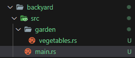
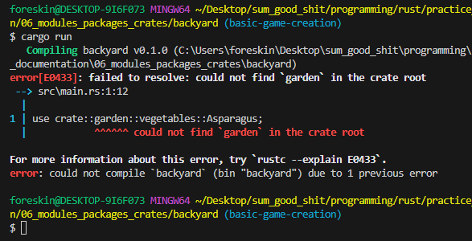
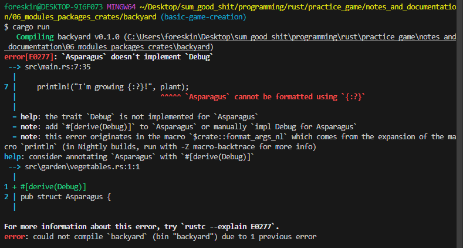

#
# [Back](./../../README.md)

# Modules
* Just like files inside a directory.

Compiler looks in `src/lib.rs` or `src/main.rs` first.

## `mod <filename_no_extension>` Keyword
* Tells to the compiler to look for a file with the name specified.
```rs
mod garden; // compiler looks for src/garden.rs or src/garden/mod.rs
```
* These are modules since they are in the crate root.

### Submodules
* Declared anywhere else *but* the crate root.
* Inside another module for instance.
* Inside the module above, for instance (`garden`), making a submodule will look like this:
```rs
mod vegetables; // compiler looks for src/garden/vegetables.rs or src/garden/vegetables/mod.rs
```

### Referring to code in modules/submodules
You can refer to code inside of a module like so:
```rs
crate::garden::vegetables::Lettuce // referring to a type named "Lettuce" in the crate.
```
* I think `crate` is a keyword within rust as well?
* For referencing the crate itself?
* Similar to `this->` in classes for C++?

## `use` Keyword
I am guessing that this is how to use a file that is local to your `crate`:

main.rs
```rs
use crate::garden::vegetables::Asparagus;

pub mod garden;

fn main() {
    let plant = Asparagus {};
    println!("I'm growing {:?}!", plant);
}
```
* We referring to code in the vegetables submodule.
    * Which itself is inside the garden module.
        * Which itself is inside our crate.
    * We then declare garden as a public module we can use?

Unfortunately, without a garden.rs, this code above will not work:


* So, you **have** to make a .rs file of the module you are making:



On top of this, within those files, you need these contents to make the code in `main.rs` work:

garden.rs
```rs
pub mod vegetables;
```

vegetables.rs
```rs
#[derive(Debug)]
pub struct Asparagus {
    
}
```
* You *have* to put `#[derive(Debug)]` or else Rust gives you an error message:


* I am guessing this is because of the print statement in the `main.rs` file.

## `pub` Keyword
* Code within modules is private by default.
* Lines declared as public are not private from its parent modules.
    * Meaning that the parent modules can use that public code.
* To make an entire module public, use:
```rs
// makes sure everything inside this module is visible to the parent module.
pub mod <module_name>;
```

* `pub` can be used on more than just modules, it can be used on items within those modules.

## `as`  Keyword

## glob operator

#
# [Back](./../../README.md)